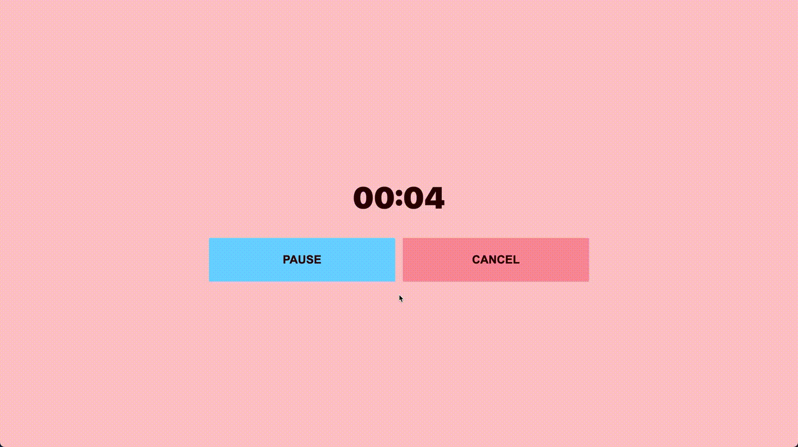
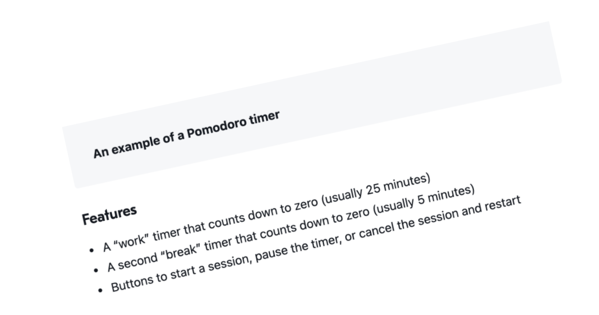

Having the word of ‘timer’ invite SETTIMEOUT to my mind and word of ‘count’ reminds me of a while loop which I am not sure about it. 

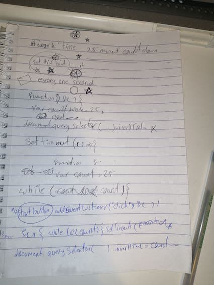

- What about  considering a function that every one second do reduction and replace the string?!!!
And we need to clear set timeout for pause or cancel. 
We might need things like<br>
`Let count=25;`
`Count--`
`document.querySelector().innerHTML`

- Actually if we are going to have settimeout so which function should put for callback.


- After I have writen basic html and css I have noticed that "oh" we have **minutes** and **seconds** means after 60 seconds should change minues ?!!!!!!!!

- Can I make a reaping function for seconds? like every 59 seconds comes back to start and for minutes every 60000 reduce 1 !!!!???????? :clock12:
- Do I need to use `setTimeut` or `seInterval` ?
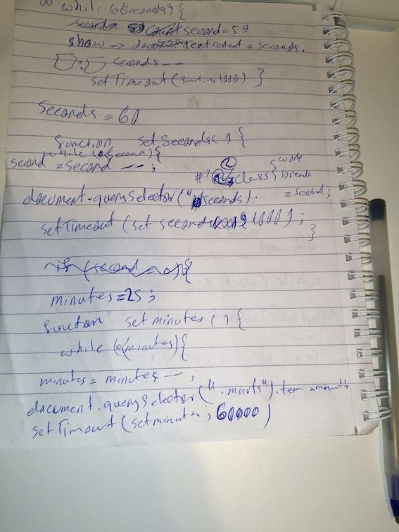

- to choose between *innerHTML, innerText, and textContent* I have read 
[betterprogramming website](https://betterprogramming.pub/whats-best-innertext-vs-innerhtml-vs-textcontent-903ebc43a3fc)

-first lines of Js
```javascript
    let workminutes = 25;
        let workseconds = 60;
        const secondsElement = document.querySelector('.seconds');
        function setSeconds() {
            workseconds--;
            secondsElement.innerText = workseconds;
            if (workseconds <= 0) {
                workseconds = 59
            }
            setTimeout(setSeconds, 1000)
        }
        document.querySelector('#start-button').addEventListener('click', setSeconds)
```

so exciting when i saw the seconds part is working,


but somethings should get changed like : to add 0 before single numbers and it went to 58 after 0 not 59

I added the function for minutes 
```javascript

        const minutesElement =  document.querySelector('.minutes');
        function setMinutes() {
            workminutes--;
            minutesElement.innerText = workminutes;
            if (workminutes <= 0) {
                workminutes = 0;
            }
            setTimeout(setMinutes, 60000)
        }
```

to call both function together when click event happens, I made a callback includes both
```javascript
  function workTimer(){
            setSeconds();
            setMinutes();
        }
```
-let's see what will happen

Ok
- I need to concatenate **Colone:**
- but before seconds comes to zero , minutes get reduce :expressionless:
what about if I add a callback function in setSeconds function when the seconds comes to zero !!!! like :

```javascript
 function setSeconds() {
            workseconds--;
            secondsElement.innerText = workseconds;
            if (workseconds <= 0) {
                workseconds = 60;
                 setMinutes()                         //this line has added and settimeout hase removed from setminutes function
            }
            setTimeout(setSeconds, 1000)
        }

           function setMinutes() {
            workminutes--;
            minutesElement.innerText = workminutes;
            if (workminutes <= 0) {
                workminutes = 0;
            }
        }
```

when I click start button the minut is 25 and it shows 25:59 but I want  24:59 so I will make a call back that first change inner html to 24
```javascript
 function setTimer(){
            minutesElement.innerText = 24;
            setSeconds();
        }
        document.querySelector('#start-button').addEventListener('click', setTimer)
```
- when the seconds was equal **1** the minute gets changed but I dont want it so I separate the if statment in the setsecond function 

-so the if statement has changed to 
```javascript
            if (workseconds == 1) {
                workseconds = 60
            }
            if(workseconds == 59){
                setMinutes();
            }
```
-ok , it looks better . so I dont need setTimer to change the htmlcontent to 24. strait away I call setSeconds then .

- now is the time to think about after finish 25 minutes work time. first I need to stop settimeout when 25 minutes finish.
- actually it is good to make these functions flexible to work for both work time and break time 
- so when I had a look at function I realiz tha I can just add some line to setMinutes to make the writen function suitable for break time as well like :
```javascript
 function setMinutes() {
            workminutes--;
            minutesElement.innerText = workminutes;
            if (workminutes < 0) {
                workminutes = 4;
            } 
        }
```
but it wnt to **-1** so I changed the place of two lines like

```javascript
 function setMinutes() {
            workminutes--;
            if (workminutes < 0) {
                workminutes = 4;
            }
            minutesElement.innerText = workminutes;
        }
```
- now when the work time finish it goes to break time directly .
- It was my first time I was going to add audio . I have searched and tried playing audio by clicking a button . It was exciting. 

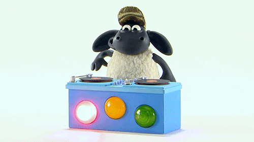

- the sounde is downloaded from [soundbible](https://soundbible.com/1630-Computer-Magic.html)

- I wanted to stop timer after break time but in this way doesnt work 
```javascript
   function setMinutes() {
            workminutes--;
            if (workminutes < 0) {
                sound.play();
                workminutes = 1;     // I uses these numbers like 1 , just to speed up function testing 
                if (workminutes == 0 && workseconds==59 ) {     //has added which was a shame . how I didnt notice 59 . I think my brin just wanted to test that way which didnt work (Hahaha)
                    clearTimeout(workTimeId);
                }
            }
            minutesElement.innerText = workminutes;
        }
```
- for now let's think about pause button 
```javascript
 function pause(){
            clearTimeout(workTimeId);
        }
        document.querySelector('#pause-button').addEventListener('click', pause)
```
- It worked :grinning:


--------------------------------------------------------------------------------------------------
Sunday 28th
------------
thinking about adjustable timeing
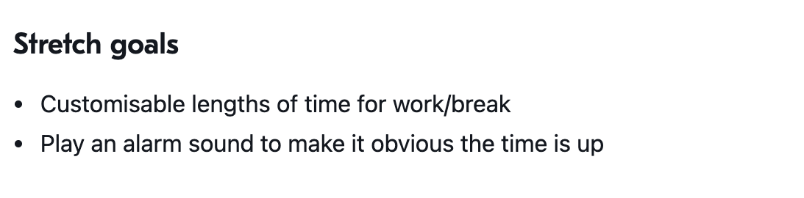
I need to search about the thing which is in my mind that is sending the user input  to javascript
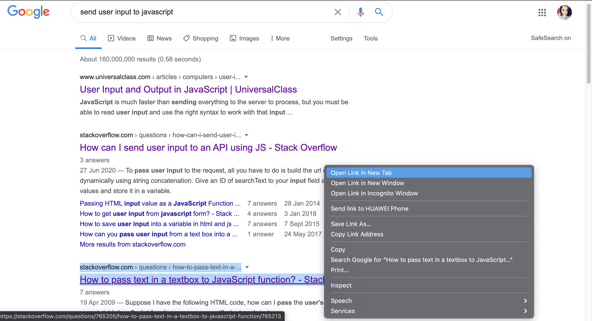

-why it doesnt work !!!!
```javascript
    var workMin;
          document.querySelector('#set-button').addEventListener('click', func)
        function func(){
            console.log('m');
            workMin = document.querySelector("input[name='work-min']").value;
        }


        var workTimeId;
        let workminutes = workMin;
 ```

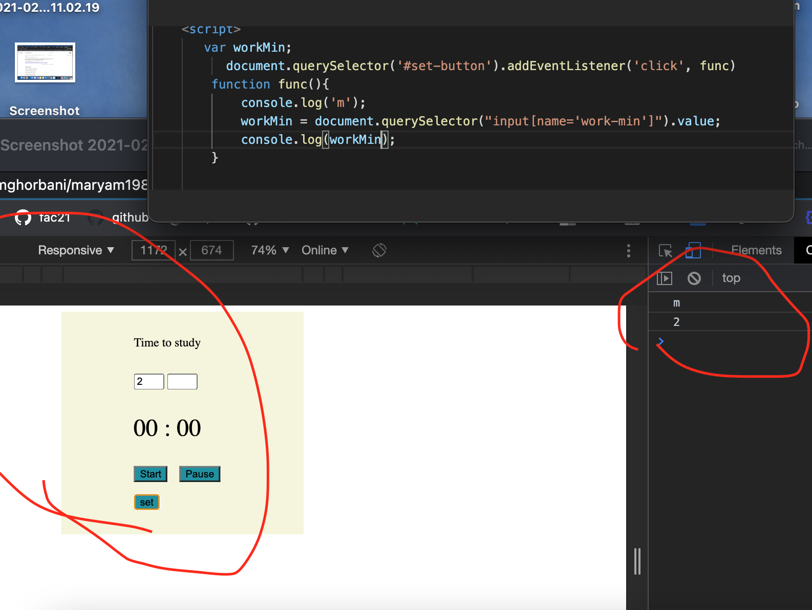

and I tried this 
```javascript
let workMin;
          document.querySelector('#set-button').addEventListener('click', func)
        function func(){
            console.log('m');
            workMin = document.querySelector("input[name='work-min']").value;
            console.log(workMin);
        }
        console.log(workMin);
```
which gave me :  
undefined
m
2
- I even added it to setSeconds or setMinutes function but gives me **NAN**

-Hey , it's working 
```javascript 
 function setMinutes() {
            let workMin = document.querySelector('#work-min').value;
            let workminutes = workMin;
            workminutes--;
            if (workminutes < 0) {
                sound.play();
                workminutes = 1;

            }
            minutesElement.innerText = workminutes;
        }
```
- I have added 
```javascript 
 if(workMin == "" || breakMin == ""){
                alert("please enter the work and break time")
            }
```
but after clicking ok , the timer starts :expressionless:
what about 
```javascript 
  if(workMin == "" || breakMin == ""){
                clearTimeout(workTimeId);
                alert("please enter the work and break time");
            }
```
I fogot to add `else{}`
so **worked**
```javascript 
  function setSeconds() {
            workMin = document.querySelector('#work-min').value;
            breakMin =  document.querySelector('#break-min').value;
            if(workMin == "" || breakMin == ""){
                clearTimeout(workTimeId);
                alert("please enter the work and break time");
            }else {
                workseconds--;
            secondsElement.innerText = workseconds;
            if (workseconds == 1) {
                workseconds = 60
            }
            if (workseconds == 59) {
                setMinutes();
            }
            workTimeId = setTimeout(setSeconds, 1000)
            }
        }
```

:question: :exclamation: It seems like , seMinutes doesnt work . !!!!!???

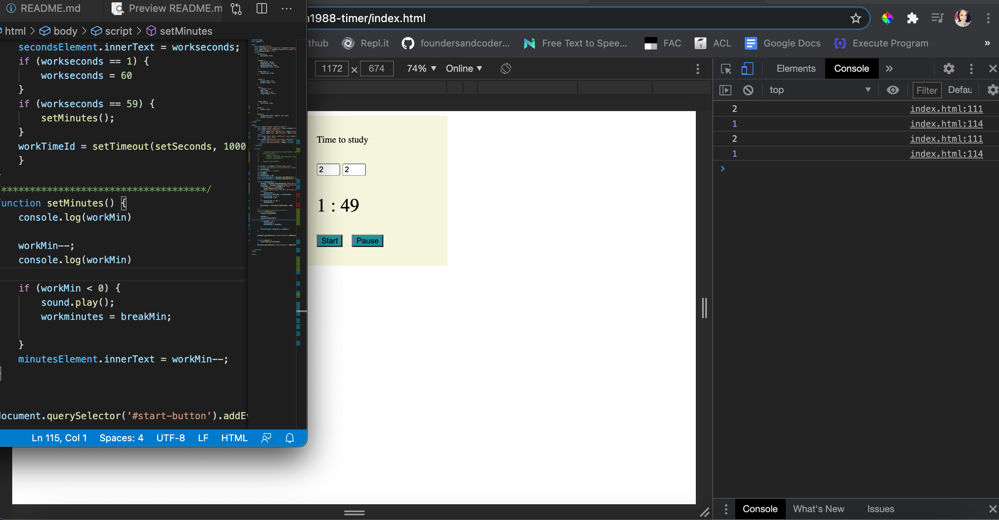

I think bxause I have declared  `workMin` and `breakMin` at the beggining of the stseonds function . I will take the out.
- but in this case setseconds doesnt recognize them and gives the error of input is empty :eyes: :sweat:

I have define a new parent function to be the callback of my start button's click event and declared those naughty variables at the beginning of it . It worked  :smiley: :hourglass_flowing_sand:

`document.querySelector('#start-button').addEventListener('click', setTimer)'

```javascript 
 function setTimer() {

            workMin = document.querySelector('#work-min').value;
            breakMin = document.querySelector('#break-min').value;

            if (workMin == "" || breakMin == "") {
                clearTimeout(workTimeId);
                alert("please enter the work and break time");
            } else {
                setSeconds()
            }
        }
```

------------------------------------------------------------------------------------------------------------------------------------
Monday 1st March
-----------------
The function was working but it went to minues . I today's sesion with the team I have learned that I can  convert the time to seconds which can be helpful as I wont need to change actual time which user has entered and it can be less confusing and  [human readable time challenge in codwars](https://www.codewars.com/kata/52685f7382004e774f0001f7/train/javascript) can help to understand.
so I have writen this function . beautiful working :heart_eyes:. actually needs more details but for now it is beautiful
```javascript
function setSecMin(){
            currentTime--
            minutes=Math.floor(currentTime/60);
            seconds=currentTime%60;
            if(minutes<10){
                minutes = '0' + minutes;
            }
            if(seconds<10){
                seconds = '0' + seconds;
            }
            timeElement.innerText = `${minutes}:${seconds}`
            workTimeId = setTimeout(setSecMin, 1000)
        }
``` 

- I have added a line to sort out transition to break time. 
```javascript
  if (currentTime <= 0) {
                sound.play();
                currentTime = breakMin * 60;

            }
```

-I have added a set function to give the user an isight of their plan before start. I mean to show the time on the screen before start.
```javascript
function set(){
    workMin = document.querySelector('#work-min').value;
            breakMin = document.querySelector('#break-min').value;
            currentTime = workMin * 60;
            minutes=Math.floor(currentTime/60);
            seconds=currentTime%60;
            if(minutes<10){                    //just to add a '0' string for the numbers less than 10 
                minutes = '0' + minutes;
            }
            if(seconds<10){
                seconds = '0' + seconds;
            }
            timeElement.innerText = `${minutes}:${seconds}`
}
```

- when I click start button more than once it trigger running function again , means `currentTime--` happens and reduce the seconds which I dont want . and because I seperate `set()` assigning variable is happening in set function , otherwise after every click the time came back to the beggining.  WHAT I can do now :question: :exclamation:
-----------------------------------------------------------------------------------------------------------------------------
Tue 2nd
---------
I was thinking about make the **set** button and **start** button to toggle . set-reset and start pause. and my brain ordered me that it might be the time to think more about css as I am more sure about most function I need . 
I like to allw user  upload a picture for background . but I want to make an image crousol as well for background
I tried to follow the method we have learned to use modifier classes but I am getting crazy actullly . 
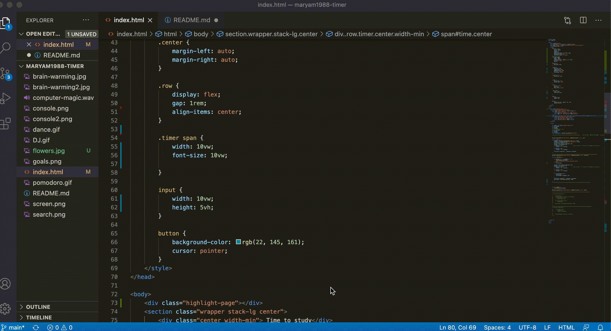
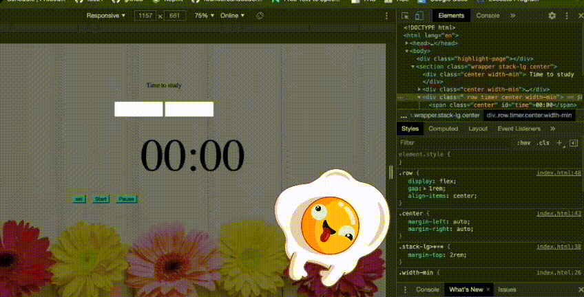