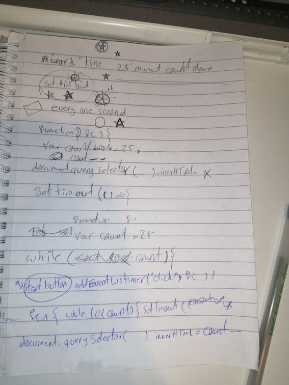

Having the word of ‘timer’ invite SETTIMEOUT to my mind and word of ‘count’ reminds me of a while loop which I am not sure about it. 



- What about  considering a function that every one second do reduction and replace the string?!!!
And we need to clear set timeout for pause or cancel. 
We might need things like<br>
`Let count=25;`
`Count--`
`document.querySelector().innerHTML`

- Actually if we are going to have settimeout so which function should put for callback.


- After I have writen basic html and css I have noticed that "oh" we have **minutes** and **seconds** means after 60 seconds should change minues ?!!!!!!!!

- Can I make a reaping function for seconds? like every 59 seconds comes back to start and for minutes every 60000 reduce 1 !!!!???????? :clock12:
- Do I need to use `setTimeut` or `seInterval` ?


- to choose between *innerHTML, innerText, and textContent* I have read 
[betterprogramming website](https://betterprogramming.pub/whats-best-innertext-vs-innerhtml-vs-textcontent-903ebc43a3fc)

-first lines of Js
```
    let workminutes = 25;
        let workseconds = 60;
        const secondsElement = document.querySelector('.seconds');
        function setSeconds() {
            workseconds--;
            secondsElement.innerText = workseconds;
            if (workseconds <= 0) {
                workseconds = 59
            }
            setTimeout(setSeconds, 1000)
        }
        document.querySelector('#start-button').addEventListener('click', setSeconds)
```

so exciting when i saw the seconds part is working,


but somethings should get changed like : to add 0 before single numbers and it went to 58 after 0 not 59

I added the function for minutes 
```

        const minutesElement =  document.querySelector('.minutes');
        function setMinutes() {
            workminutes--;
            minutesElement.innerText = workminutes;
            if (workminutes <= 0) {
                workminutes = 0;
            }
            setTimeout(setMinutes, 60000)
        }
```

to call both function together when click event happens, I made a callback includes both
```
  function workTimer(){
            setSeconds();
            setMinutes();
        }
```
-let's see what will happen

Ok
- I need to concatenate **Colone:**
- but before seconds comes to zero , minutes get reduce :expressionless:
what about if I add a callback function in setSeconds function when the seconds comes to zero !!!! like :

```
 function setSeconds() {
            workseconds--;
            secondsElement.innerText = workseconds;
            if (workseconds <= 0) {
                workseconds = 60;
                 setMinutes()                         //this line has added and settimeout hase removed from setminutes function
            }
            setTimeout(setSeconds, 1000)
        }

           function setMinutes() {
            workminutes--;
            minutesElement.innerText = workminutes;
            if (workminutes <= 0) {
                workminutes = 0;
            }
        }
```

when I click start button the minut is 25 and it shows 25:59 but I want  24:59 so I will make a call back that first change inner html to 24
```
 function setTimer(){
            minutesElement.innerText = 24;
            setSeconds();
        }
        document.querySelector('#start-button').addEventListener('click', setTimer)
```
- when the seconds was equal **1** the minute gets changed but I dont want it so I separate the if statment in the setsecond function 

-so the if statement has changed to 
```
            if (workseconds == 1) {
                workseconds = 60
            }
            if(workseconds == 59){
                setMinutes();
            }
```
-ok , it looks better . so I dont need setTimer to change the htmlcontent to 24. strait away I call setSeconds then .

- now is the time to think about after finish 25 minutes work time. first I need to stop settimeout when 25 minutes finish.
- actually it is good to make these functions flexible to work for both work time and break time 
- so when I had a look at function I realiz tha I can just add some line to setMinutes to make the writen function suitable for break time as well like :
```
 function setMinutes() {
            workminutes--;
            minutesElement.innerText = workminutes;
            if (workminutes < 0) {
                workminutes = 4;
            } 
        }
```
but it wnt to **-1** so I changed the place of two lines like

```
 function setMinutes() {
            workminutes--;
            if (workminutes < 0) {
                workminutes = 4;
            }
            minutesElement.innerText = workminutes;
        }
```
- now when the work time finish it goes to break time directly .
- It was my first time I was going to add audio . I have searched and tried playing audio by clicking a button . It was exciting. 


- the sounde is downloaded from [soundbible](https://soundbible.com/1630-Computer-Magic.html)

- I wanted to stop timer after break time but in this way doesnt work 
```
   function setMinutes() {
            workminutes--;
            if (workminutes < 0) {
                sound.play();
                workminutes = 1;     // I uses these numbers like 1 , just to speed up function testing 
                if (workminutes == 0 && workseconds==59 ) {     //has added which was a shame . how I didnt notice 59 . I think my brin just wanted to test that way which didnt work (Hahaha)
                    clearTimeout(workTimeId);
                }
            }
            minutesElement.innerText = workminutes;
        }
```
- for now let's think about pause button 
```
 function pause(){
            clearTimeout(workTimeId);
        }
        document.querySelector('#pause-button').addEventListener('click', pause)
```
- It worked :grinning:


--------------------------------------------------------------------------------------------------
Sunday 28th
------------
thinking about adjustable timeing

I need to search about the thing which is in my mind that is sending the user input  to javascript
